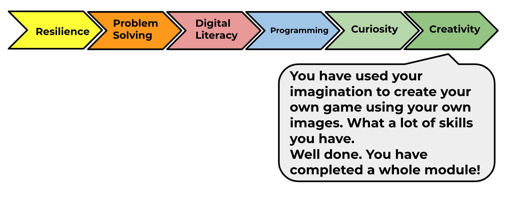

## What have you learned?

Congratulations on completing the 'Boat race' project!  Would you like to try something a little more challenging?

--- no-print ---
Click on the green flag to start. Watch the sequence of colours shown by the dancer's dress and listen to the accompanying drum beats, then repeat the colours back to her. If you get the colours' order wrong, it's game over!

    

<iframe allowtransparency="true" width="485" height="402" src="//scratch.mit.edu/projects/embed/284452634/?autostart=false" frameborder="0" allowfullscreen scrolling="no"></iframe>

--- /no-print ---

--- print-only ---

--- /print-only ---

Click on the ‘Click me’ button to complete the Plenary for this module. Then start another module and learn something completely new such as the 'Memory' project in the Scratch 2 module:

<a href="https://codeclub.org/en/projects-cc">

